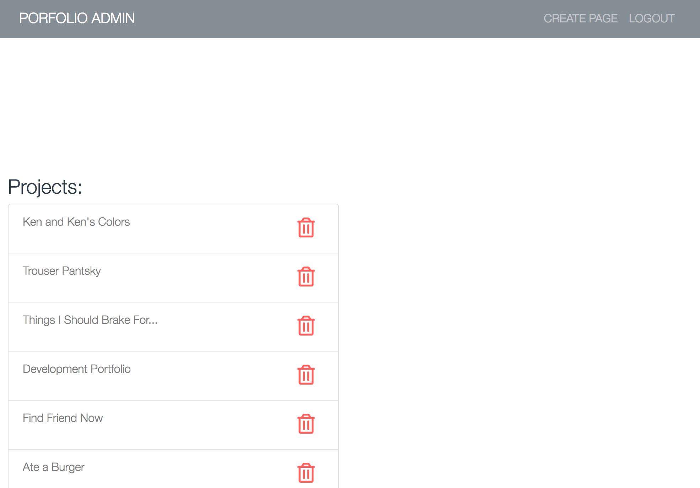

# Ray Becoskie Porfolio
Full Stack Developer Portfolio
-
### Link to project

Link to working project:
- [heroku](https://becoskie-portfolio.herokuapp.com/)

## Description
Developer portfolio built as a CMS. Using MYSQL to dynamically create the content. Full authenticated admin page used for handling the CRUD.

## The Build
- bcrypt-nodejs
- body-parser
- dotenv
- express
- express-handlebars
- express-session
- mysql2
- passport
- passport-local
- sequelize

## Screenshots

**Admin view**

## Connect
[Linkedin](https://www.linkedin.com/in/rbecoskie/)

## License
MIT © [Ray Becoskie]()

